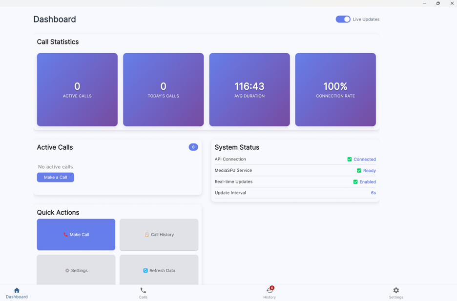

# VOIP Multi-Platform Communication System

[](https://opensource.org/licenses/MIT)
[](https://mediasfu.com)
[](https://flutter.dev)
[](https://reactjs.org)
[](https://reactnative.dev)
[](https://www.typescriptlang.org)

This mono-repository contains MediaSFU reference clients for web, mobile, and desktop environments. The solutions demonstrate how to integrate the MediaSFU communications platform across React.js, Flutter, React Native, and Expo, with an Angular desktop experience coming soon.

> **Agent orchestration superpowers**
>
> - **Agent-only concierge mode** handles full conversations with MediaSFU Agents, handing off transcripts and context in near real time.
> - **Instant human takeover** keeps supervisors one tap away via the cross-platform "Take Control" flow in `MediaSFURoomDisplay`.
> - **Blended agent + human calls** switch between automation and humans without audio drops, syncing context through MediaSFU source switching.
> - **Play-to-all versus caller-only audio** lets teams broadcast bot prompts or keep coaching private, adjustable mid-call.

- MediaSFU platform: <https://mediasfu.com>
- MediaSFU telephony: <https://mediasfu.com/telephony>
- MediaSFU agents workspace: <https://agents.mediasfu.com>

## Prebuilt downloads

Kick the tires instantly with samples built from this repository:

- 🪟 **Windows desktop installer** (Flutter build): [MediaSFU-Setup.exe](https://mediasfu.com/apps/MediaSFU-Setup.exe)
- 🤖 **Android (Flutter)**: [mediasfu-voip-flutter.apk](https://mediasfu.com/apps/mediasfu-voip-flutter.apk)
- 📱 **Android (React Native)**: [mediasfu-voip-rn.apk](https://mediasfu.com/apps/mediasfu-voip-rn.apk)

> ℹ️ macOS `.app` bundles and iOS TestFlight builds are in flight—subscribe in Discussions to be notified when they drop.

## Table of contents

- [Overview](#overview)
- [System architecture](#system-architecture)
- [Repository structure](#repository-structure)
- [Platform matrix](#platform-matrix)
- [Core capabilities](#core-capabilities)
- [Gallery](#gallery)
- [Getting started](#getting-started)
- [Development workflow](#development-workflow)
- [Build and deployment](#build-and-deployment)
- [MediaSFU integration](#mediasfu-integration)
- [Support and resources](#support-and-resources)
- [Contributing](#contributing)
- [License](#license)
- [Status](#status)

## Overview

The VOIP Multi-Platform Communication System provides a consistent MediaSFU-powered experience across multiple client technologies. Each application shares the same core concepts—dialing, room management, and participant control—while embracing the strengths of its respective framework.

Key objectives:

- Deliver ready-to-run examples for MediaSFU product teams, integrators, and customer success engineers.
- Showcase configurable dialer flows, outbound call orchestration, and MediaSFU room management.
- Maintain uniform logging and analytics across platforms.
- Document a practical migration path between frameworks.

## System architecture

```text
VOIP System Architecture
├── Client applications
│   ├── React.js (web)
│   ├── Flutter (iOS/Android/Desktop)
│   ├── React Native (iOS/Android)
│   ├── React Native + Expo (iOS/Android/Web)
│   └── Angular + Electron (desktop, planned)
├── Media layer
│   ├── WebRTC transport
│   ├── MediaSFU rooms and signaling
│   └── Participant session management
└── Deployment surfaces
    ├── Web hosting (Vercel, Netlify, or similar)
    ├── Apple App Store and Google Play
    └── Desktop installers (planned)
```

## Repository structure

```text
VOIP/
├── voip_reactjs/      React.js + TypeScript web client
├── voip_flutter/      Flutter mobile and desktop client
├── voip_rn/           React Native CLI mobile client
├── voip_rn_expo/      Expo-managed React Native client
├── voip_angular/      Angular desktop client (coming soon)
└── README.md          Root documentation (this file)
```

## Platform matrix

| Platform | Technology | Status | Primary targets | Documentation |
| --- | --- | --- | --- | --- |
| Web | React.js + TypeScript | Shipping | Modern browsers, PWA | [Web README](./voip_reactjs/README.md) |
| Native mobile | Flutter + Dart | Shipping | iOS, Android, desktop beta | [Flutter README](./voip_flutter/README.md) |
| Native mobile (JS) | React Native CLI + TypeScript | Shipping | iOS, Android | [React Native README](./voip_rn/README.md) |
| PWA + mobile | Expo + React Native | Shipping | iOS, Android, Web | [Expo README](./voip_rn_expo/README.md) |
| Desktop | Angular + Electron | In design | Windows, macOS, Linux | [Angular README](./voip_angular/README.md) |

## Core capabilities

Common capabilities implemented across the production-ready clients include:

- **Dialer** – E.164-compliant number entry and normalization using MediaSFU dial plan rules.
- **MediaSFU room lifecycle** – Creation, join, leave, and teardown flows with logging via the shared `CallService`/`callService` utilities.
- **Call state management** – Hooks/providers (React) and ChangeNotifiers (Flutter) that keep the active call, queued calls, and call history in sync.
- **Configurable UI** – Theme toggles, layout density options, and dashboard widgets tailored to each framework.
- **Telemetry hooks** – Optional analytics callbacks surfaced through MediaSFU SDK interceptors for live operations teams.

Feature specifics:

- **React.js** – Visual room dashboards, live call tiles, configuration modals, and history filters. Implementation details live in `voip_reactjs/src/components/Calls/CallsPage.tsx` and its associated hooks.
- **Flutter** – Material/Cupertino hybrid UI with dialpad and MediaSFU session widgets. Primary logic resides in `lib/pages/calls_page.dart` alongside Provider-based state.
- **React Native** – Shared TypeScript utilities, gesture-friendly controls, and integration with native permissions. Key files include `voip_rn/src/components/Calls/CallsPage.tsx` and `voip_rn/src/services/callService.ts`.
- **Expo** – Tabbed navigation, OTA update support, and an installable web experience. See `voip_rn_expo/app/(tabs)` and `src/services` for implementation.

## Gallery

|  |  |
|---|---|
|  |  |

## Getting started

### Prerequisites

- Git
- Node.js 18 or newer (with npm or Yarn)
- Flutter SDK 3.35.4 or newer (for the Flutter client)
- Android Studio (with Android SDK) and Xcode 15+ for native builds

### Clone and install

```bash
git clone https://github.com/MediaSFU/VOIP.git
cd VOIP
```

Install dependencies for the client you want to explore:

- Web: `cd voip_reactjs && npm install`
- Flutter: `cd voip_flutter && flutter pub get`
- React Native CLI: `cd voip_rn && npm install`
- Expo: `cd voip_rn_expo && npm install`

Environment templates are available within each project folder. Duplicate the `.env.example` file (where present), supply your MediaSFU credentials, and restart the dev server.

## Development workflow

1. Select the target client and start the relevant development server (`npm start`, `flutter run`, `npx react-native run-android`, or `npx expo start`).
2. Update configuration via the Settings or Config panels to point at your MediaSFU environment.
3. Exercise the dialer, join MediaSFU rooms, and review call history widgets to verify signalling.
4. Use the shared logging utilities (`logger.ts`, `logger.dart`) to troubleshoot media events.
5. Run automated checks (`npm test`, `flutter test`, or `npx tsc --noEmit`) before committing changes.

## Build and deployment

| Client | Command | Output |
| --- | --- | --- |
| React.js | `npm run build` | `voip_reactjs/build` static assets |
| Flutter | `flutter build apk --release` / `flutter build ios --release` | Native binaries (Android/iOS) |
| React Native | `cd android && ./gradlew assembleRelease` / Xcode Archive | Store-ready artifacts |
| Expo | `npx expo export` or EAS Build | OTA/PWA bundles |

Refer to each sub-project README for signing, store submission, and automation notes.

## MediaSFU integration

Each client surfaces:

- **Room APIs** – Creation, join, update, and teardown via the MediaSFU REST endpoints.
- **Participant controls** – Mute/unmute, video toggles, and room moderation.
- **Telemetry** – Optional hooks for streaming call quality metrics to MediaSFU analytics.

For end-to-end service configuration, visit:

- MediaSFU Telephony: <https://mediasfu.com/telephony>
- MediaSFU Agent Workspace (beta): <https://agents.mediasfu.com>

## Support and resources

- MediaSFU documentation: <https://mediasfu.com/docs>
- MediaSFU playground: <https://agents.mediasfu.com>
- Submit product questions at <https://mediasfu.com/contact>
- GitHub issues are monitored for bug reports and enhancement requests.

## Contributing

All contributions are coordinated through the MediaSFU engineering team.

1. Fork the repository and create a feature branch.
2. Align with the coding conventions outlined in the sub-project READMEs.
3. Add automated tests where applicable and run platform-specific linters.
4. Submit a pull request describing the change, testing performed, and MediaSFU endpoints touched.

## License

This project is licensed under the MIT License. See [LICENSE](LICENSE) for details.

## Status

- React.js web client – actively maintained (production reference)
- Flutter client – actively maintained (production reference)
- React Native CLI client – actively maintained (production reference)
- Expo client – actively maintained (PWA and mobile reference)
- Angular desktop client – in design (planned release Q4 2025)

**Last updated:** September 25, 2025  
**Maintained by:** MediaSFU Engineering
